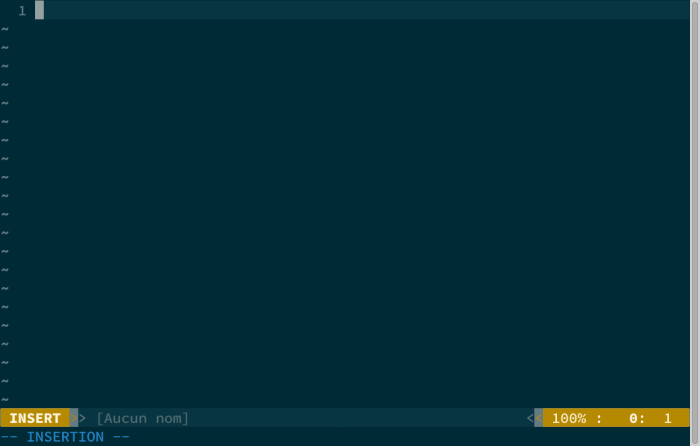

Zerby Dico
==========

Version 0.1

Last Change : 2015-09-17

Author : Emmanuel Grognet (emmanuel AT grognet DOT fr)

License : Provided under the GPL (http://www.gnu.org/copyleft/gpl.html).

Description :
=============

Zerby dico is the french dictionnary for Vim editor.



Usage :
==============

For example, you can put into your .vimrc

```
nnoremap <buffer> <leader>zd :call ZerbyDico()<CR>

vnoremap <buffer> <leader>zd :call ZerbyDico()<CR>
```
This will map leader+zd to lookup into the dictionnary for the item under the cursor.
